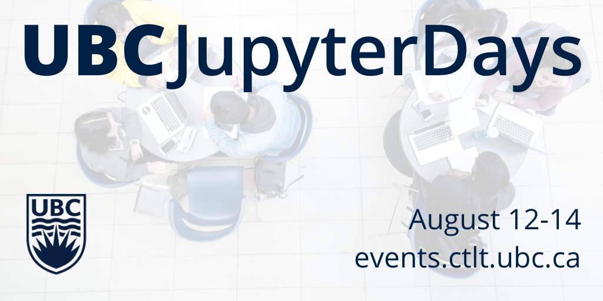

# UBC Jupyter Days

[Jupyter notebook](https://jupyter.org) is a web application for producing computational narratives: a notebook in the browser which runs code and renders text, mathematical notation, images and videos. Jupyter notebook is a powerful open source tool for scientific computing, reproducible research and teaching data science.

Come join other instructors, researchers and students at UBC to share their Jupyter experiences and to learn about new Jupyter tools!

## Registration

All workshops and presentations are hosted on Zoom. Please register at [UBC CTLT Events](https://events.ctlt.ubc.ca/events/jupyter-days-2020/) to join us!

## August 12, 2020

[**Day 1: Getting started teaching with Jupyter**](schedule/day1.md)

Get up and running quickly with [Jupyter](https://jupyter.org) and start developing content for your courses. Learn about [Syzygy](https://syzygy.ca), [GitHub](https://github.com), [nbgitpuller](https://jupyterhub.github.io/nbgitpuller/), [Jupyter Book](https://jupyterbook.org) and [Python](https://www.python.org) packages for data science.

## August 13, 2020

[**Day 2: Pedagogy and assessment**](schedule/day2.md)

Learn about good pedagogical practices when teaching with Jupyter and develop course assessments with [nbgrader](https://nbgrader.readthedocs.io).

## August 14, 2020

[**Day 3: New developments in the data science and Jupyter education space**](schedule/day3.md)

A series of short presentations highlighting new and exciting Jupyter tools for teaching.
